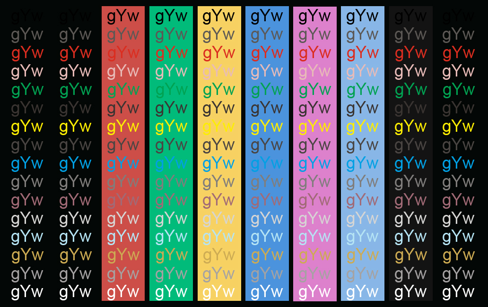

# Chameleon for [Windows Terminal](https://github.com/microsoft/terminal)

> A dark theme for [Windows Terminal](https://github.com/microsoft/terminal).

## install
To install the theme, access the file [`install.md`](https://github.com/ChameleonTheme/WindowsTerminal/blob/master/install.md)

## author
This theme is maintained by [Mario Matsui](https://github.com/MarioMatsui)
---

## Show your support
Give a ⭐️ if this project helped you!
